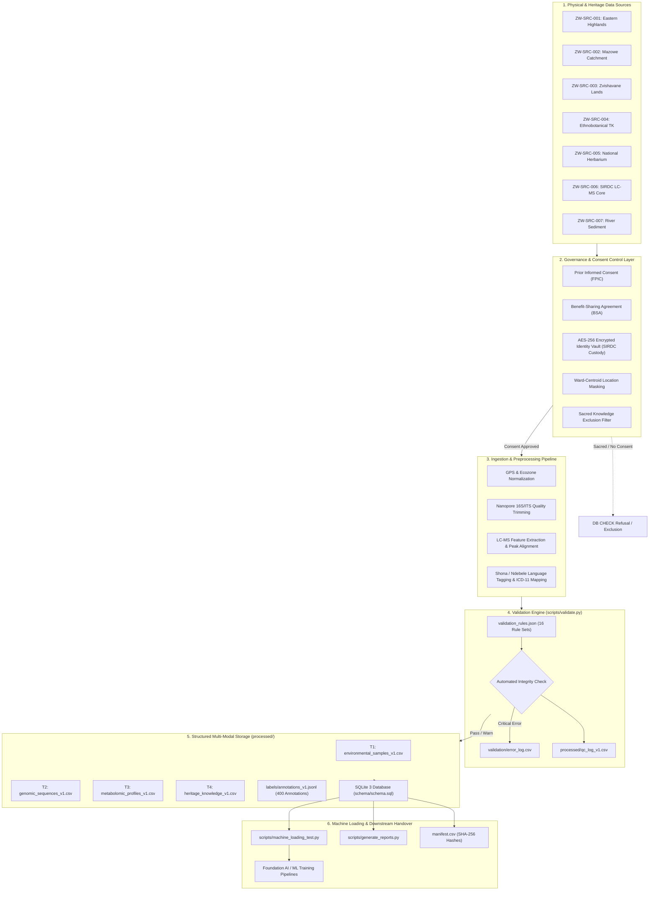
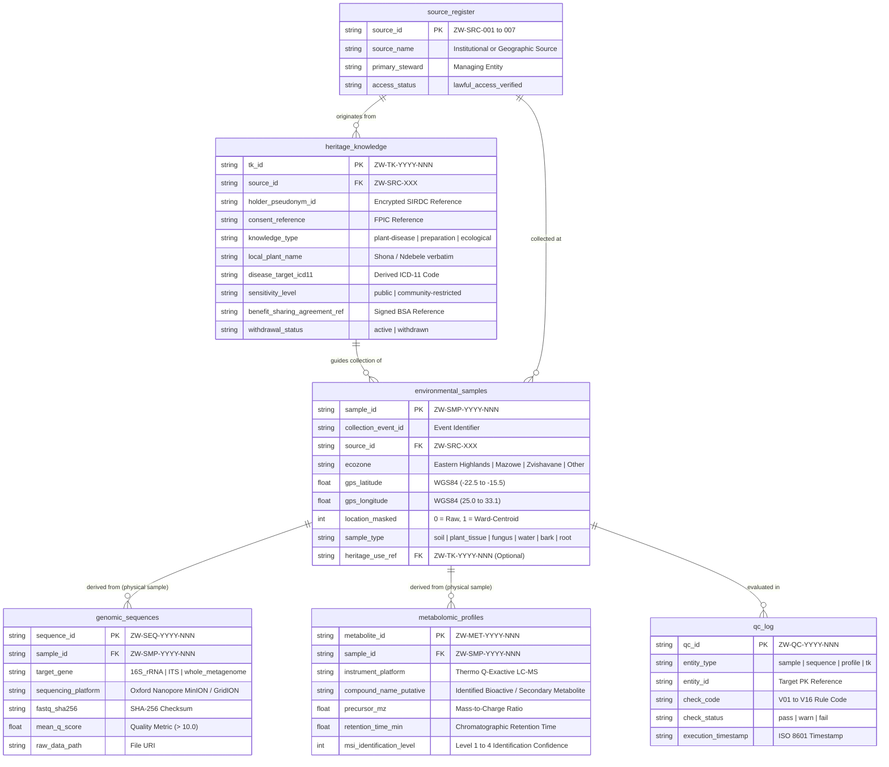
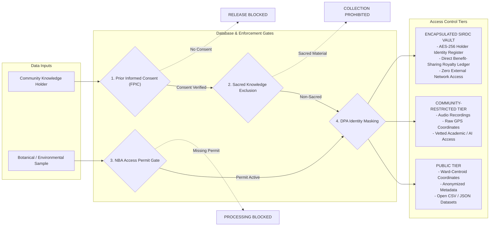
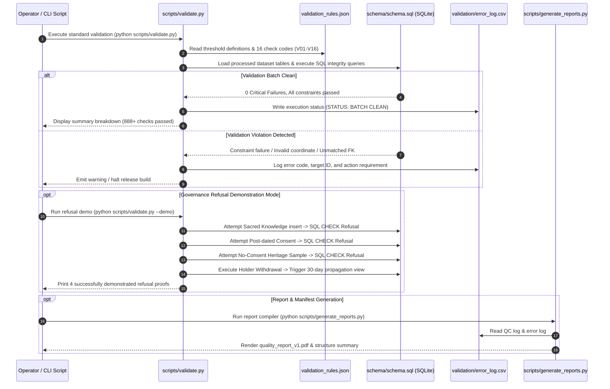

# ZW-BioBank v1.0 — Project Structure & Architecture Specification

**Miti AI Consortium · POTRAZ AI for Impact Challenge 2026 · Track 1: Data (T1)**  
Lead Innovator: **Mutsa M Mutepfa** · Team: **Miti AI Consortium**  
Presenter & Data Engineer: **Winston J Mambongo**  
Primary Steward: **SIRDC (Scientific and Industrial Research and Development Centre)** · Technical Maintainer: **Miti AI**

---

## 1. Executive Overview

**ZW-BioBank v1.0** is a sovereign, controlled-access, multi-modal biological dataset of Zimbabwe. It is structured so that foundation AI models can learn from indigenous natural product metabolomics, metagenomics, and traditional botanical heritage, while ensuring indigenous communities are protected under the Zimbabwe Data Protection Act (DPA Ch. 12:07) and guaranteed benefit-sharing royalties through Prior Informed Consent (PIC) and Benefit-Sharing Agreements (BSA).

### Key Highlights:
- **3 Focal Specimen Pillars**: Medicinal Ginger (*Siphonochilus aethiopicus* & *Zingiber officinale*), Pepper-Bark Tree (*Warburgia salutaris*), and Water Hyacinth (*Eichhornia crassipes*).
- **317 Multi-Modal Records across 5 Tables**: Environmental Samples (T1), Genomic Sequences (T2), Metabolomic Profiles (T3), Heritage Knowledge (T4), and QC Log (T5).
- **400 Applied AI Annotations**: Covering phytochemistry, therapeutic target mapping (ICD-11), metagenomics, and conservation alerts.
- **Zero-Dependency Verification**: Pure Python standard library automated validation engine (`scripts/validate.py`) enforcing 888+ quality checks and 4 structural governance database constraints.

---

## 2. Comprehensive Directory & File Structure

```
mitiai_zw_biobank_v1.0_ai4i_data/
├── README.md                               # Focal pillars, Track 1 evidence mapping, & walkthrough blueprint
├── PROJECT_ARCHITECTURE.md                 # System architecture, ERD diagrams, & file structure reference
├── manifest.csv                            # Cryptographic handover inventory (path, size, SHA-256, version, sensitivity)
├── metadata/                               # Machine-readable metadata cards
│   ├── dataset_metadata.json               # Top-level dataset metadata card (Annex B schema)
│   ├── subset_metadata_environmental.json  # T1 Environmental samples metadata card
│   ├── subset_metadata_genomic.json        # T2 Genomic sequences metadata card
│   ├── subset_metadata_metabolomic.json     # T3 Metabolomic profiles metadata card
│   └── subset_metadata_tk.json             # T4 Heritage knowledge metadata card
├── schema/                                 # Schema definitions, SQL DDL, & ERD diagrams
│   ├── data_dictionary.csv                 # 156-field comprehensive dictionary (Annex A schema)
│   ├── data_dictionary.xlsx                # Formatted Excel dictionary with coverage summary
│   ├── schema.json                         # Machine-readable JSON schema export
│   ├── schema.sql                          # SQLite 3 DDL schema (tables, foreign keys, CHECK constraints, views)
│   └── erd.svg                             # Scalable Vector Graphics entity-relationship diagram
├── processed/                              # Read-only structured production datasets
│   ├── environmental_samples_v1.csv        # T1 Environmental Samples (120 records - physical collection spine)
│   ├── environmental_samples_v1.xlsx       # T1 Excel format
│   ├── genomic_sequences_v1.csv            # T2 Genomic Sequences (55 records - 16S/ITS/Metagenomics)
│   ├── genomic_sequences_v1.xlsx           # T2 Excel format
│   ├── metabolomic_profiles_v1.csv         # T3 Metabolomic Profiles (90 records - LC-MS bioactives & features)
│   ├── metabolomic_profiles_v1.xlsx        # T3 Excel format
│   ├── heritage_knowledge_v1.csv           # T4 Heritage Knowledge (52 records - Traditional Ethnobotany)
│   ├── heritage_knowledge_v1.xlsx          # T4 Excel format
│   ├── qc_log_v1.csv                       # T5 Quality Control Log (Automated validation trace)
│   ├── qc_log_v1.xlsx                      # T5 Excel format
│   └── zw_biobank_v1.0_all_tables.xlsx     # Combined multi-tab workbook of all 5 core tables
├── raw/                                    # Raw collection evidence & registered source manifests
│   ├── zw_src_001_eastern_highlands/       # Source ZW-SRC-001 (Eastern Highlands wild/cultivated flora)
│   ├── zw_src_002_mazowe/                  # Source ZW-SRC-002 (Mazowe Valley agricultural & river catchment)
│   ├── zw_src_003_zvishavane/              # Source ZW-SRC-003 (Zvishavane communal lands)
│   ├── zw_src_004_heritage_knowledge/      # Source ZW-SRC-004 (Traditional knowledge interviews)
│   ├── zw_src_005_national_herbarium/      # Source ZW-SRC-005 (National Herbarium voucher verification)
│   ├── zw_src_006_sirdc_lcms/              # Source ZW-SRC-006 (SIRDC LC-MS core laboratory platform)
│   └── zw_src_007_opportunistic/           # Source ZW-SRC-007 (Opportunistic environmental monitoring)
├── labels/                                 # Machine Learning training labels & annotation guide
│   ├── label_taxonomy.csv                  # 10 formal label classes with positive/negative examples
│   ├── annotation_guide.pdf                # Annotation methodology, verification, & adjudication guide
│   └── annotations_v1.jsonl                # 400 applied machine learning annotation records
├── validation/                             # Automated quality rules & release audit trails
│   ├── validation_rules.json               # 16 quality check rule definitions & thresholds
│   ├── quality_report_v1.pdf               # Generated PDF Quality Report (Annex D compliant)
│   └── error_log.csv                       # Real-time warning/error log from validation engine
├── governance/                             # Legal, ethics, consent, & compliance frameworks
│   ├── source_register.csv                 # Register of 7 physical sources with access terms & fallbacks
│   ├── bias_risk_register.csv              # 8 identified bias/risk metrics with SQL audit queries
│   ├── dpa_compliance_matrix.csv           # Zimbabwe Data Protection Act (Ch. 12:07) compliance matrix
│   ├── consent_log.csv                     # Anonymized registry of Prior Informed Consent (PIC) records
│   ├── consent_template.pdf                # Standardized PIC field interview template
│   ├── access_policy.pdf                   # Open vs Controlled access policy specification
│   ├── anonymization_plan.pdf              # AES-256 identity masking & location blurring protocol
│   ├── budget_refresh_and_handover.csv     # Financial handover & maintenance schedule
│   ├── next_90_days.md                     # Post-challenge implementation roadmap
│   ├── progress_log.csv                    # Project milestone tracking log
│   ├── self_assessment_checklist.csv       # POTRAZ §7 self-assessment checklist
│   ├── target_population_and_sampling.md   # Ecozone & ethnobotanical sampling frame methodology
│   └── license.txt                         # Sovereign controlled-access data license terms
└── scripts/                                # Python automation engine (Standard Library only)
    ├── validate.py                         # Quality control validator & governance refusal demonstration engine
    ├── machine_loading_test.py             # Machine readiness tester (CSV, Pandas, SQLite, QGIS, R)
    ├── generate_reports.py                 # Automated PDF report compiler (Quality & Handover reports)
    └── build_manifest.py                   # Cryptographic SHA-256 manifest generator & integrity verifier
```

---

## 3. Architecture Diagrams

### Diagram 1: Overall End-to-End System & Data Pipeline Architecture

The end-to-end architecture ingests multi-modal raw data from physical collection sources, enforces strict governance gates and location masking, validates data through pure Python rules, structures datasets into SQLite/CSV tiers, and exposes machine-ready data for AI/ML modeling and institutional handover.



---

### Diagram 2: Relational Schema & Entity-Relationship Architecture (ERD)

The data architecture is structured around five core tables linked via strict foreign key relationships and traceable provenance.



---

### Diagram 3: Governance, Legal & Security Architecture

The governance framework enforces legal compliance with the Zimbabwe Data Protection Act (DPA Ch. 12:07), Nagoya Protocol, and National Biotechnology Authority (NBA) guidelines.



---

### Diagram 4: Validation Engine Workflow & Proofs Architecture

The automated validation engine (`scripts/validate.py`) executes 888+ checks across 7 quality dimensions and supports interactive refusal demonstrations.



---

## 4. Technical Specifications & Structural Constraints

### 4.1 The Four Structural Governance Constraints
Governance policies in ZW-BioBank v1.0 are enforced at the database engine level inside [`schema/schema.sql`](file:///C:/Users/HP/Downloads/Miti%20Ai%20BioBank_v1.0/mitiAI_ZW_Biobank%20v1.1_Dataset/mitiai_zw_biobank_v1.0_ai4i_data/schema/schema.sql) and cannot be overridden by application logic:

| Rule | Description | SQL / Validator Constraint |
|---|---|---|
| **1. Consent Gate** | A sample collected via ethnobotanical guidance MUST link to a valid Prior Informed Consent reference. | `CHECK (heritage_use_ref IS NULL OR consent_reference IS NOT NULL)` |
| **2. Sacred Exclusion** | Sacred traditional knowledge is never collected or stored in the database under any condition. | `CHECK (sensitivity_level IN ('public', 'community-restricted'))` |
| **3. Prior Consent** | Consent must be formally granted prior to or on the exact date of the field interview. | `CHECK (consent_date <= interview_date)` |
| **4. Permit Gate** | Physical specimen processing cannot be finalized without an active NBA permit reference. | `nba_permit_ref IS NOT NULL` check during sample processing stage |

---

### 4.2 Focal Specimen Lineages

| Pillar Specimen | Shona / Ndebele Name | Target Organ | Primary Bioactives / Metabolites | Core Application |
|---|---|---|---|---|
| **Medicinal Ginger**<br>*(Siphonochilus aethiopicus* & *Zingiber officinale)* | *Tsangamidzi* (sn)<br>*Isiphepheto* (nd) | Rhizome & Root | Siphonochilone, [6]-Gingerol, [6]-Shogaol, Zerumbone | Respiratory distress, asthma, antimicrobial assays |
| **Pepper-Bark Tree**<br>*(Warburgia salutaris)* | *Muranga* (sn)<br>*Isibhaha* (nd) | Trunk Bark & Leaf | Muzigadial, Polygodial, Warburganal, Verbascoside | Chest infections, malarial fever, COX anti-inflammatory |
| **Water Hyacinth**<br>*(Eichhornia crassipes)* | *Yacinthi Yemumvura* (sn)<br>*Inkazana Yemanzini* (nd) | Aquatic Plant & Sediment | Rhizobiome endophytes (*Streptomyces*), Luteolin, Apigenin | Heavy metal phytoremediation & environmental monitoring |

---

### 4.3 Technical Verification Suite (5 Minimum Proofs)

The repository provides five standalone, zero-dependency Python scripts to demonstrate compliance with the AI for Impact Challenge requirements:

```bash
# PROOF 1: Load Data & Verify Machine Readiness across Python, SQL, GIS
python scripts/machine_loading_test.py

# PROOF 2 & 4: Execute Full Data Provenance Trace & Run Quality Checks
python scripts/validate.py

# PROOF 4: Demonstrate 4 Automated Governance & Refusal Gates
python scripts/validate.py --demo

# PROOF 3 & 5: Generate Structure Summaries & Compliance PDF Reports
python scripts/generate_reports.py

# PROOF 5: Verify Cryptographic SHA-256 Manifest & File Handover Integrity
python scripts/build_manifest.py --verify
```

---
*Miti AI Consortium · Scientific Sovereignty & AI Innovation for Zimbabwe*
